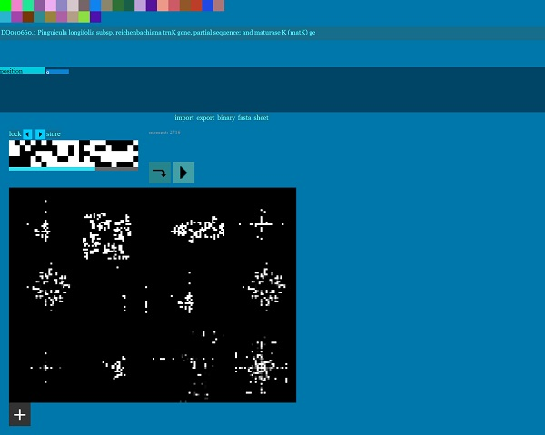
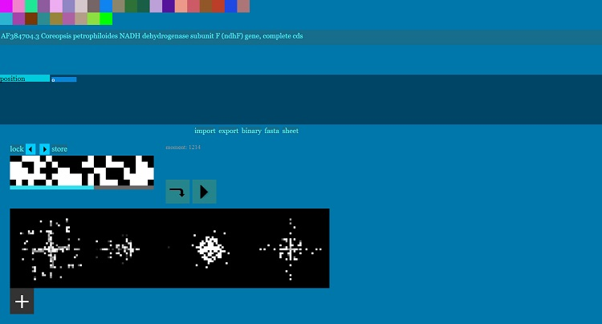

# neodna
Translates binary sequences and DNA into turtle-like graphical information and images using a library of functions.

A simple program would be:  
code__move  
code__write  
code__direction  
code__origin  
code__codex  
code__move

Tested in Google Chrome, Firefox and Opera browsers. The program uses local IndexedDB storage, you can use the import option in the main program to import the existing database of examples.

The design of the program is intended to facilitate exploration of DNA using visual and graphical interpretation of sequences and changes to sequences as opposed to logical changes, and is merely an experiment for the time being. The turtle concept has been around since early computer graphics and the program is an extension of that idea.

